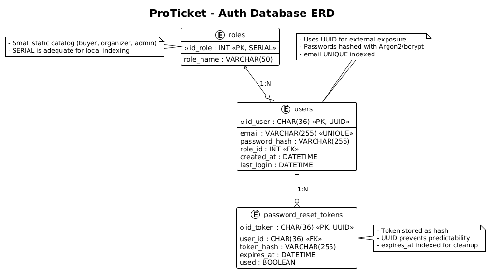
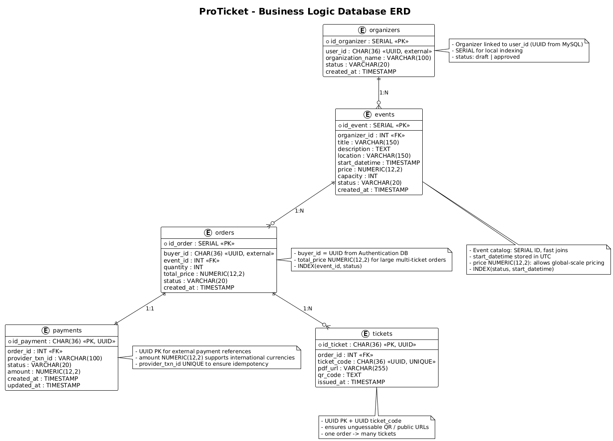

## 1. Overview

The **ProTicket** platform is architected around two backends:

- **Java Backend (Authentication)** → MySQL
    
- **Python Backend (Business Logic)** → PostgreSQL
    

This dual-backend setup separates **security-sensitive user data** from **business operations** (events, orders, tickets).  
Identifiers follow a **hybrid strategy**:

- Use **UUIDs** where unpredictability or external exposure occurs (e.g., `users`, `tickets`, `payments`).
    
- Use **SERIAL (auto-increment)** where internal sequential tracking is sufficient (e.g., `roles`, `events`, `orders`).
    

This balance improves **security** without sacrificing **performance** or **simplicity**.

---

## 2. Database Architecture Overview

|Layer|Backend|Database|Purpose|
|---|---|---|---|
|**Authentication Service**|Java (Spring Boot)|MySQL|User accounts, roles, password recovery, token issuance|
|**Business Logic Service**|Python (FastAPI/Flask)|PostgreSQL|Event creation, ticket sales, payments, reports|

Each backend communicates through REST APIs, using shared `user_id` values (UUID) and JWT-based authorization.

---

## 3. Logical Model and Table Descriptions

### 3.1 Authentication Database (MySQL)

|Table|Description|Key Fields|
|---|---|---|
|**users**|Stores registered user credentials with UUID IDs.|`id_user` (UUID PK), `email`, `password_hash`, `role_id`, `created_at`, `last_login`|
|**roles**|Defines access levels (buyer, organizer, admin).|`id_role` (SERIAL PK), `role_name`|
|**password_reset_tokens**|Controls password reset requests.|`id_token` (UUID PK), `user_id` (FK), `token_hash`, `expires_at`, `used`|

**Hybrid Justification**

- `users.id_user` → UUID (security-critical, exposed externally).
    
- `roles.id_role` → SERIAL (internal fixed set).
    
- `password_reset_tokens.id_token` → UUID (prevents guessable reset links).
    

---

#### Password Hashing

- Implemented with **Argon2** (preferred) or **bcrypt** (min 12 rounds).
    
- Example (Spring Boot):
    
    ```java
    BCryptPasswordEncoder encoder = new BCryptPasswordEncoder(12);
    String hash = encoder.encode(password);
    ```
    
- Stored as:
    
    ```sql
    password_hash VARCHAR(255)
    ```
    
- Password reset tokens stored as **hashed tokens (`token_hash`)**, not plaintext.
    

---

#### Indexing Strategy (MySQL)

|Index|Purpose|
|---|---|
|`UNIQUE(email)`|Quick login lookups|
|`INDEX(role_id)`|Fast role joins|
|`INDEX(expires_at)`|Cleanup of expired tokens|

These indexes maintain O(log n) lookups while keeping write performance stable.

---

### 3.2 Business Logic Database (PostgreSQL)

| Table                      | Description                                | Key Fields                                                                                                                                     |
| -------------------------- | ------------------------------------------ | ---------------------------------------------------------------------------------------------------------------------------------------------- |
| **organizers**             | Registered event creators linked to users. | `id_organizer` (SERIAL PK), `user_id` (UUID external), `organization_name`, `status`, `created_at`                                             |
| **events**                 | Defines public event data.                 | `id_event` (SERIAL PK), `organizer_id` (FK), `title`, `description`, `location`, `start_datetime`, `price`, `capacity`, `status`, `created_at` |
| **orders**                 | Purchase orders created by buyers.         | `id_order` (SERIAL PK), `buyer_id` (UUID external), `event_id` (FK), `quantity`, `total_price`, `status`, `created_at`                         |
| **payments**               | Payment transaction data.                  | `id_payment` (UUID PK), `order_id` (FK), `provider_txn_id`, `status`, `amount`, `created_at`, `updated_at`                                     |
| **tickets**                | Issued digital tickets.                    | `id_ticket` (UUID PK), `order_id` (FK), `ticket_code` (UUID UNIQUE), `pdf_url`, `qr_code`, `issued_at`                                         |
| **sales_reports** _(view)_ | Summary of sales by event.                 | `event_id`, `sold_tickets`, `gross_revenue`, `remaining_capacity`                                                                              |

**Hybrid Justification**

- `organizers`, `events`, `orders` → SERIAL (internal domain, manageable sequence).
    
- `payments`, `tickets` → UUID (external references and QR exposure).
    
- `buyer_id`, `user_id` (FK-like fields) → UUID to sync with MySQL’s user records.
    

---

#### Indexing Strategy (PostgreSQL)

|Index|Purpose|
|---|---|
|`INDEX(events_status_date)`|Optimize event listing/filtering|
|`INDEX(orders_event_status)`|Query orders by event efficiently|
|`UNIQUE(ticket_code)`|Prevent duplicate ticket issuance|
|`INDEX(payments_provider_txn)`|Detect duplicate webhook calls|
|`INDEX(orders_buyer)`|Buyer purchase history lookup|

**Full-text search** can be added for events via:

```sql
CREATE INDEX idx_events_search ON events USING GIN (to_tsvector('english', title || ' ' || description));
```

---

## 4. JWT Authentication Flow (Cross-Backend)

### Flow Description

1. **Login (Java Backend)**
    
    - User authenticates with email/password.
        
    - Credentials verified using hashed password.
        
    - On success, a JWT token is issued (HMAC-SHA256) containing:
        
        ```json
        {
          "user_id": "uuid-1234",
          "role": "buyer",
          "iat": 1730800000,
          "exp": 1730803600
        }
        ```
        
2. **Client stores token** (HTTP-only cookie or secure local storage).
    
3. **Request to Business API (Python)**
    
    - Header: `Authorization: Bearer <jwt>`.
        
    - Token signature validated using shared secret.
        
    - Claims extracted for authorization:
        
        - Role validation (`buyer` vs `organizer`)
            
        - User validation for ownership (e.g., `/orders/{buyer_id}`)
            
4. **Automatic expiration** (e.g., 1 hour).
    
    - Refresh handled by Java backend.
        
    - Stateless scaling enabled.
        

**Benefits**

- No session persistence needed across servers.
    
- Both backends share a verification key (`JWT_SECRET`).
    
- Each request carries authorization context securely.
    

---

## 5. Data Integrity and Business Rules

|Rule|Description|
|---|---|
|**Hybrid UUID/SERIAL**|UUIDs for externally exposed entities (users, payments, tickets); SERIAL for internal relations.|
|**Capacity rule**|Decrease capacity only when payment confirmed.|
|**Idempotency**|Prevent duplicate payments via unique `provider_txn_id`.|
|**Atomicity**|Payment + ticket issuance in one transaction.|
|**Consistency**|Failed payments preserve order but no tickets issued.|
|**Authorization**|Buyer and organizer actions validated via JWT claims.|

---

## 6. Design Objectives

- **Security:** Mix of UUID and SERIAL ensures safety where exposure risk exists.
    
- **Performance:** SERIAL maintains speed on high-write tables; UUIDs ensure unguessable references.
    
- **Scalability:** Stateless JWT, optimized indices, and transactional integrity.
    
- **Extensibility:** Easy to plug in new services (refunds, analytics).
    
- **Auditability:** UUID-based logs and timestamps for full traceability.
    

---

## 7. Diagrams

### Auth Database


### Business Logic Database

